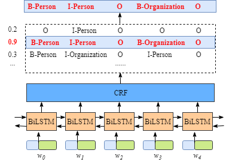
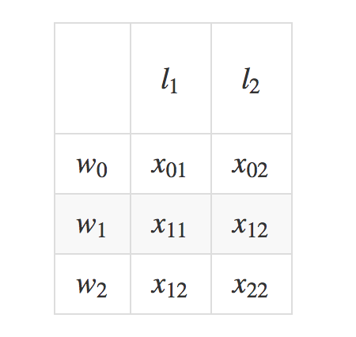
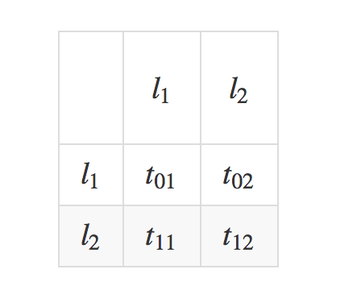
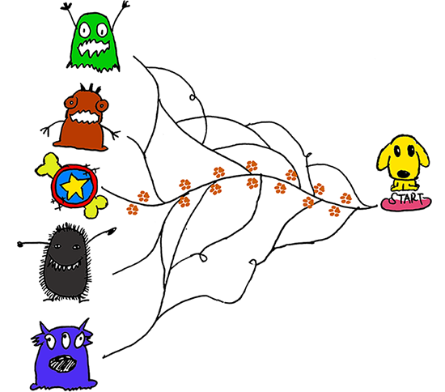

<b>A bi-lstm-crf model for named entity recongnition</b>

Author:[yz_lee](https://github.com/lyzKF)		Email:lyz038015@163.com

#Outline:		
[Dataset introduction](#Dataset introduction)	
[Bi-lstm-crf model](#Bi-lstm-crf model)		
[Contrains learned by crf-layer](#Contrains learned by crf-layer)		
[Crf-layer](#Crf-layer)		
[Infer the labels for a new sentence](#infer_labels)	
******
#CRF Layer on the top of bi-lstm
this [paper]<https://arxiv.org/abs/1603.01360> proposed a bi-lstm-crf named entity recognition model which used word and character embeddings.
## Dataset introduction		
we assume that, we have a dataset in which we have **5 entity types**.
>- B-person 
>- I-person 
>- B-organization 
>- I- organization 
>- O
## Bi-lstm-crf model	
A brief introduction of bi-lstm-crf model:	
******	
>1. every word in sentence x is represented as a vector which includes the **word's character and word embedding**. **The character embedding is initialized randomly. the word embedding usually is from a pre-trained word embedding file**. all the embeddings will be fine-tuned during the training process.
>2. the inputs of bi-lstm-crf model are those embeddings and the outputs are predicted labels for words in x.
>3. the outputs of bi-lstm layer are the scores of each label. and these scores will be the inputs of crf layer.
>4. In the crf layer, the label sequence which has **the highest prediction score would be selected as the best answer**.

It is not necessary to know the details of BiLSTM layer, in order to understand the CRF layer more easily, we have to know what is the meaning of the output of BiLSTM Layer.	

	
## Contrains learned by crf-layer   	
The **CRF layer could add some constrains to the final predicted labels to ensure they are valid**. and these constrains can be **learned by the CRF layer automatically** from training dataset during the training process.
The constrains could be:	
>- The label of the first word in a sentence should start with “B-“ or “O”, not “I-“.
>- “B-label1 I-label2 I-label3 I-…”, in this pattern, label1, label2, label3 … should be the same named entity label. For example, “B-Person I-Person” is valid, but “B-Person I-Organization” is invalid.
>- “O I-label” is invalid. The first label of one named entity should start with “B-“ not “I-“, in other words, the valid pattern should be “O B-label”			
## CRF layer    
For the loss function of crf-layer, we have 2 types of scores. they are the key concepts of crf-layer.	
### Emission scores
Emission scores come from the bi-lstm layer.For convenience, we will give each label a index number as shown in the table below.		

| Label | Index | 
| :-: | :-: | 
| B-Person | 0|
| I-Person | 1 |
| B-Organization | 2 |
| I-Organization | 3 |
| O | 4 |

| $$label/index$$ | $$w_0$$ | $$w_1$$ | $$w_2$$ | $$w_3$$ | $$w_4$$ | 
| :-: | :-: | :-: | :-: | :-: | :-: |
| B-Person | 1.5| 0.2| 0.9| 0.003| 0.12|
| I-Person | 0.9 | 0.4| 0.02| 0.002| 0.2|
| B-Organization | 0.1 | 0.1| 0.03| 0.2| 0.1|
| I-Organization | 0.08 | 0.11| 0.08| 0.07| 0.065|
| O | 0.05 | 0.05| 0.1| 0.05| 0.5|

we use $x_i,_j$ to represent the emission score. **i** is the index of word and **j** is the index of label.
For instance, $x_{i=1,j=2} = x_{w_1,B-organization} = 0.1$, which means the score of $w_1$ as B-organization is 0.1.	
###Trainsition scores				
We have a **transition score matrix** which stores all the scores between all the labels, $t_{i,j}$ represents a trainsition score. For example, $t_{B-person, I-persion}=0.9$ means the score of label transition **B-person -> I-person** is 0.9. In order to **make the transition score matrix more robust**, we will add two more labels, **START** and **END**. **START** means the start of a sentence, NOT the first word. **END** means the end of sentence.	
Here is an example of the transition matrix score including the extra added START and END labels.		

|  | START| B_person| I-person | B-Organization | I-Organization | O | END |		
| :-: | :-: | :-: | :-: | :-: | :-: | :-: |	:-: |	
| START | 0| 0.8| 0.007| 0.7 | 0.0008 | 0.9 | 0.08 |	
| B-Person | 0 | 0.6 | 0.9 | 0.2 | 0.0006 | 0.6| 0.009 |	
| I-Person | -1 | 0.5 | 0.53 | 0.55 | 0.0003 | 0.85 | 0.008 |	
| B-Organization | 0.9 | 0.5 | 0.0003 | 0.25 | 0.8 | 0.77 | 0.006 |		
| I-Organization | -0.9 | 0.45 | 0.007 | 0.7 | 0.65 | 0.76 | 0.2 |		
| O | 0 | 0.65 | 0.0007 | 0.7 | 0.0008 | 0.9 | 0.08 |		
| END | 0 | 0 | 0 | 0 | 0 | 0 | 0 |		

**Where or how to get the transition matrix?**		
Actually, the matrix is **a paramer of a BiLSTM-CRF model**. Before you train the model, you could initialize all the transition scores in the matrix randomly. **All the random scores will be updated automatically during your training process**. In other words, the CRF layer can learn those constraints by itself. To build the matrix manually is not necessary. The scores will be more and more reasonable gradually with increasing training iterations.	
###CRF loss function	
The CRF loss function is consist of the real path score and the total score of all the possible paths. **The real path shoule have the highest score** among those of all the possible paths. Assume that evety possible path has a score $P_i$ and there are totally *N* possible paths, the total score of paths is as follows.	$$P_{total} = \sum_{i=1}^NP_i = \sum_{i=1}^N e^{s_i}$$		
**During the training process, the parameter values of bi-lstm-layer model will be updated again ans again to keep increasing the percentage of the score of the real path.**	
$$LossFunction = \frac{P_{real path}}{\sum_{i=1}^N p_i}$$		
Here are 3 questions:
>- how to define the score of a path?
>- how to calculate the total score of all possible paths?
>- when we calculate the total score, and to list all the possible paths is necessary?	
###Real path score  	
During the training process, the crf loss function only need 2 scores: **the score of real path** and ** the total score of all possible paths**. the calculation of a real path score$e^{s_i}$ is very straightforward. 	
Here we focus on the calculation of $s_i$.	Take the real path "START B-person i-person O B-Organization O END" for example.	
>- we have a sentence which has 5 words.$w_i, w_2, w_3, w_4, w_5$.		
>- to add 2 more extra words $w_0, w_6$, which denote the **START** and **END** of a sentence.	
>- $s_i$ consists of 2 parts. $s_i = EmissionScore + TransitionScore$	

Emission Score = $x_{0,START}$ + $x_{1,B-person}$ + $x_{2,I-person}$ + $x_{3,O}$ + $x_{4,B-Organization}$ + $x_{5,O}$ + $x_{6,END}$	
>- $x_{index,label}$ is the score if the $index^th$ word is labelled by **label**.	
>- $x_{index,label}$ is from the previous bi-lstm output.	
>- $x_{0,START}$ and $x_{6,END}$ are initialized as zeros.	

Transition Score = $t_{START -> B-person}$ + $t_{B-person -> I-person}$ + $t_{I-person -> O}$ + $t_{O -> B-Organization}$ + $t_{B-Organization -> O}$ + $t_{O -> END}$	
>- $t_{label1 -> label2}$ is the transition score from label1 to label2.		
>- $t_{label1 -> label2}$ is from crf-layer.		

###The total score of all possible paths	
The simplest way to calculate the total score is to calculate all the possible paths and sum their scores. But it is very inefficient and will spend more training time. Here is a better method.	
1. recall the crf loss function and change it into a log loss function. Because when we are training a model, usually our goal is to minimize out loss function. we add a negative sign to loglossfunction.	
$$loglossfunction = -\log{\frac{p_{realpath}}{\sum_{i=1}^Np_i}}$$	
2. recall the Emission and Transition score 		
To simplify, we assume we are training our model from this toy sentence whose lenght is only 3.	$$x = [w_0, w_1, w_2]$$ Moreover, we have 2 label. $$LabelSet = \{l_1，l_2\}$$		
**Emission scores** and **Transition scores**:			

		
3.calculate $log{\sum_{i=1}^Ne^{s_1}}$		
The process is an accumlation of scores, and the idea is similar with dynamic programing. In short, the total score of all possible paths of $w_0$ is calculated. Then, we use the total score to calculate that of $w_0 -> w_1$. Finally, we use the lastest total score to calculate that of $w_0 -> w_1 -> w_2$. and the final total score is what we need.	
	Now we need to define 2 variables: **obs** and **prev**. **prev** stores the final results of **prev** steps, **obs** denotes the information from current word.				
******
$w_0:$
$$obs = [x_{01}, x_{02}]$$ 
$$prev=None$$
**what is the total score of all the possible paths of $w_0$?** The answer is very simple and it is:
$$total\_score(w_0) = \log{(e^{x_{01}} + e^{x_{02}})}$$
******
$w_0 -> w_1:$
$$obs = [x_{11}, x_{12}]\qquad expand--> \qquad obs = \bigl( \begin{matrix} x_{11} & x_{12} \\ x_{11} & x_{12} \end{matrix} \bigr)$$
$$prev = [x_{01}, x_{02}]\qquad expand--> \qquad prev = \bigl( \begin{matrix} x_{01} & x_{01} \\ x_{02} & x_{02} \end{matrix} \bigr)$$
$$scores = prev + obs + transition\_scores$$
$$scores = \bigl( \begin{matrix} x_{01} & x_{01} \\ x_{02} & x_{02} \end{matrix} \bigr) + \bigl( \begin{matrix} x_{11} & x_{12} \\ x_{11} & x_{12} \end{matrix} \bigr)  + \bigl( \begin{matrix} t_{11} & t_{12} \\ t_{21} & t_{22} \end{matrix} \bigr)$$
$$scores = \bigl( \begin{matrix} x_{01}+x_{11}+t_{11} & x_{01}+x_{12}+t_{12} \\ x_{02}+x_{11}+t_{21} & x_{02}+x_{12}+t_{22} \end{matrix} \bigr)$$
Change the value of prev for the next iteration:  	
$$prev = [log{( e^{x_{01} + x_{11} + t_{11}} + e^{x_{02} + x_{11} + t_{21}})}, log{( e^{x_{01} + x_{12} + t_{12}} + e^{x_{02} + x_{12} + t_{22}})}]$$
Actually, the second iteration has been finished. **but how to calculate the total score of all possible paths from $w_0$ to $w_1$?** $$ total\_score(w_0 -> w_1) = \log(e^{prev[0]} + e^{prev[1]})$$
$$total\_score(w_0 -> w_1) = \log(e^{x_{01} + x_{11} + t_{11}} + e^{x_{02} + x_{11} + t_{21}} + e^{x_{01} + x_{12} + t_{12}} + e^{x_{02} + x_{12} + t_{22}})$$
In the equation, we can see:
$$s_1 = x_{01} + x_{11} + t_{11}(label1 -> label1)$$
$$s_2 = x_{02} + x_{11} + t_{21}(label1 -> label2)$$
$$s_3 = x_{01} + x_{12} + t_{12}(label2 -> label1)$$
$$s_4 = x_{02} + x_{12} + t_{22}(label2 -> label2)$$
then:
$$total\_score(w_0 -> w_1) = \log(e^{s_1} + e^{s_2} + e^{s_3} + e^{s_4})$$
******
$w_0 -> w_1 -> w_2:$
In this iteration, we will do the same procedure as described in the last iteration.
$$obs = [x_{21}, x_{22}]$$
$$prev = [\log(e^{x_{01} + x_{11} +t_{11}} + e^{x_{02} + x_{11} +t_{21}}),\log(e^{x_{01} + x_{12} +t_{12}} + e^{x_{02} + x_{12} +t_{22}})]$$
expand obs and prev:
$$obs = \bigl( \begin{matrix} x_{21} & x_{22} \\ x_{21} & x_{22} \end{matrix} \bigr)$$
$$prev = \bigl( \begin{matrix} \log(e^{x_{01} + x_{11} +t_{11}} + e^{x_{02} + x_{11} +t_{21}}) & \log(e^{x_{01} + x_{11} +t_{11}} + e^{x_{02} + x_{11} +t_{21}}) \\ \log(e^{x_{01} + x_{12} +t_{12}} + e^{x_{02} + x_{12} +t_{22}}) & \log(e^{x_{01} + x_{12} +t_{12}} + e^{x_{02} + x_{12} +t_{22}}) \end{matrix} \bigr)$$
$$scores = \bigl( \begin{matrix} \log(e^{x_{01} + x_{11} +t_{11}} + e^{x_{02} + x_{11} +t_{21}}) + x_{21} + t_{11} & \log(e^{x_{01} + x_{11} +t_{11}} + e^{x_{02} + x_{11} +t_{21}}) + x_{22} + t_{12} \\ \log(e^{x_{01} + x_{12} +t_{12}} + e^{x_{02} + x_{12} +t_{22}}) + x_{21} + t_{21} & \log(e^{x_{01} + x_{12} +t_{12}} + e^{x_{02} + x_{12} +t_{22}}) + x_{22} + t_{22} \end{matrix} \bigr)$$
change the value of prev for next iteration:
$$prev = [\log((e^{x_{01} + x_{11} +t_{11}} + e^{x_{02} + x_{11} +t_{21}}) e^{x_{21} + t_{11}} + (e^{x_{01} + x_{12} +t_{12}} + e^{x_{02} + x_{12} +t_{22}}) e^{x_{21} + t_{21}}), \\ \log((e^{x_{01} + x_{11} +t_{11}} + e^{x_{02} + x_{11} +t_{21}}) e^{x_{22} + t_{12}} + (e^{x_{01} + x_{12} +t_{12}} + e^{x_{02} + x_{12} +t_{22}}) e^{x_{22} + t_{22}})]$$
As described in the last iteration, we use the elements in the new previous to calculate the total score:
$$ total\_score(w_0 -> w_1 -> w_2) = \log(e^{prev[0]} + e^{prev[1]})$$

###Infer the labels for a new sentence		
In this section, we will explore how to inder the labels for a sentence, we have the same assumption in 
[assumption](#assume). if you were familar with Viterbi algorithm, this section would be easy for you. we 
will run the inference algorithm from left to right of the sentence as shown below:
>- $w_0$
>- $w_0 -> w_1$
>- $w_0 -> w_1 -> w_2$			

**obs** and **prev** have the same values in [obs&&prev](#obs_prev). and we define 2 variables **$alpha_0$** and **$alpha_1$**, **$alpha_0$** is the history of best scores and **$alpha_1$** is the history of the corresponding indexes. you can treat these 2 variables as "marks" the dog made along the road when he explores the forest and these "marks" would be helpful to assist him finding the way to get back home.

		
******	
$w_0:$
$$obs = [x_{01}, x_{02}]$$
$$prev = None$$
Currently, we are observing the first word $w_0$ and the best label for $w_0$ is straightforward. Eg, if 
$ obs = [x_{01} = 0.2,x_{02} = 0.8]$, the best label for $w_0$ should be $l_2$. Because there is only one word and no transitions between labels, the transition scores are not used.		
******
$w_0 -> w_1:$
$$obs = [x_{11}, x_{12}]\qquad expand--> \qquad obs = \bigl( \begin{matrix} x_{11} & x_{12} \\ x_{11} & x_{12} \end{matrix} \bigr)$$
$$prev = [x_{01}, x_{02}]\qquad expand--> \qquad prev = \bigl( \begin{matrix} x_{01} & x_{01} \\ x_{02} & x_{02} \end{matrix} \bigr)$$
$$scores = prev + obs + transition\_scores$$
$$scores = \bigl( \begin{matrix} x_{01} & x_{01} \\ x_{02} & x_{02} \end{matrix} \bigr) + \bigl( \begin{matrix} x_{11} & x_{12} \\ x_{11} & x_{12} \end{matrix} \bigr)  + \bigl( \begin{matrix} t_{11} & t_{12} \\ t_{21} & t_{22} \end{matrix} \bigr)$$
$$scores = \bigl( \begin{matrix} x_{01}+x_{11}+t_{11} & x_{01}+x_{12}+t_{12} \\ x_{02}+x_{11}+t_{21} & x_{02}+x_{12}+t_{22} \end{matrix} \bigr)$$
**Change the value of prev for the next iteration**:  	
$$prev = [max(scores[00], scores[10]), max(scores[01], scores[11])]$$
>In our corpus, we totally have 2 labels, $l_1$ and $l_2$. the index of these 2 labels are 0 and 1		
>prev[0] is the maximum score of the path which ends with $l_1$		
>prev[1] is the maximum score of the path which ends with $l_2$

For example, if our score is:$$scores = [\bigl( \begin{matrix} 0.2 & 0.3 \\ 0.5 & 0.4 \end{matrix} \bigr)]$$
our prev for the next iteration would be: $$prev = [0.5, 0.4]$$ **what is the meaning of prev? the prev list stores the maximum score to each label of the current word**.
At the same time, we also have 2 variables to store the history information(scores and indexes),$alpha_0$ and $alpha_1$.
for this iteration, we will add the best scores into $alpha_0$. For your convenience, the maximum score of each label was
underlined.$$scores = \bigl( \begin{matrix} 0.2 & 0.3 \\ \underline{0.5} & \underline{0.4} \end{matrix} \bigr)$$
$$alpha_0 = [(scores[10],scores[11])] = [(0.5,0.4)]$$
In addition, the corresponding **column indexes** were kept in $alpha_1$:
$$alpha_1 = [(column\_index(scores[10]),column\_index(scores[11]))] = [(1,1)]$$
For explanation, the index of $l_1$ is 0 and $l_2$ is 1. (1,1) = ($l_2$,$l_2$). for the current word $w_i$ and label $l_i$:	 
we can get the maximum score 0.5 when the path is $l_{i-1} = l_2$ ---> $l_i = l_1$		
we can get the maximum score 0.4 when the path is $l_{i-1} = l_2$ ---> $l_i = l_2$		
$l_{i-1}$ is the label of the previous word $w_{i-1}$.		
******
$w_0 -> w_1 -> w_2:$
$$obs = [x_{21}, x_{22}]\qquad expand--> \qquad obs = \bigl( \begin{matrix} x_{21} & x_{22} \\ x_{21} & x_{22} \end{matrix} \bigr)$$
$$prev = [0.5, 0.4]\qquad expand--> \qquad prev = \bigl( \begin{matrix} 0.5 & 0.5 \\ 0.4 & 0.4 \end{matrix} \bigr)$$
$$scores = prev + obs + transition\_scores$$
$$scores = \bigl( \begin{matrix} 0.5 & 0.5 \\ 0.4 & 0.4 \end{matrix} \bigr) + \bigl( \begin{matrix} x_{21} & x_{22} \\ x_{21} & x_{22} \end{matrix} \bigr)  + \bigl( \begin{matrix} t_{11} & t_{12} \\ t_{21} & t_{22} \end{matrix} \bigr)$$
$$scores = \bigl( \begin{matrix} 0.5+x_{21}+t_{11} & 0.5+x_{22}+t_{12} \\ 0.4+x_{21}+t_{21} & 0.4+x_{22}+t_{22} \end{matrix} \bigr)$$
**Change the value of prev for the next iteration**:  	
$$prev = [max(scores[00], scores[10]), max(scores[01], scores[11])]$$
For example, if our score is:$$scores = [\bigl( \begin{matrix} 0.6 & \underline{0.9} \\ \underline{0.8} & 0.7 \end{matrix} \bigr)]$$
Actually, the larger one between $previous[0]$ and $previous[1]$ is the score of the best predicted path.At the same time,  the maximum scores of each label and indexes will be added into $alpha_0$ and $alpha_1$.
$$alpha_0 = [(0.5,0.4),(scores[10],scores[01])] = [(0.5,0.4),(0.8,0.9)]$$
$$alpha_1 = [(1,1),(1,0)]$$
For explanation, the index of $l_1$ is 0 and $l_2$ is 1. (1,0) = ($l_2$,$l_1$). for the current word $w_i$ and label $l_i$:
we can get the maximum score 0.8 when the path is $l_{i-1} = l_2$ ---> $l_i = l_1$		
we can get the maximum score 0.9 when the path is $l_{i-1} = l_1$ ---> $l_i = l_2$		
$l_{i-1}$ is the label of the previous word $w_{i-1}$.		
**********
In this step, $alpha_0$ and $alpha_1$ will be used to find the path with highest score. We will check the elements in these two lists from the last one to the first one.		
we can get the maximum score 0.5 when the path is $l_{i-1} = l_2$ ---> $l_i = l_1$		
we can get the maximum score 0.9 when the path is $l_{i-1} = l_1$ ---> $l_i = l_2$		
The best path we get is $$l_2 --> l_1 --> l_2$$.	
**The following formula helps understand these derivation：**		
$$score = prev + obs + \bigl(\begin{matrix} t_{11} & t_{12} \\ t_{21} & t_{22} \end{matrix} \bigr)$$
$w_0 -> w_1$:		
$$scores = [\bigl( \begin{matrix} 0.2 & 0.3 \\ \underline{0.5} & 0.4 \end{matrix} \bigr)]$$
$w_1 -> w_2$:		
$$scores = [\bigl( \begin{matrix} 0.6 & \underline{0.9} \\ 0.8 & 0.7 \end{matrix} \bigr)]$$
0.5 corresponds to $t_{21}$ and 0.9 corresponds to $t_{12}$.
### References			
[1] <https://arxiv.org/abs/1603.01360>		
[2] <http://colah.github.io/posts/2015-08-Understanding-LSTMs>		
[3] <https://www.jianshu.com/p/55755fc649b1>			

